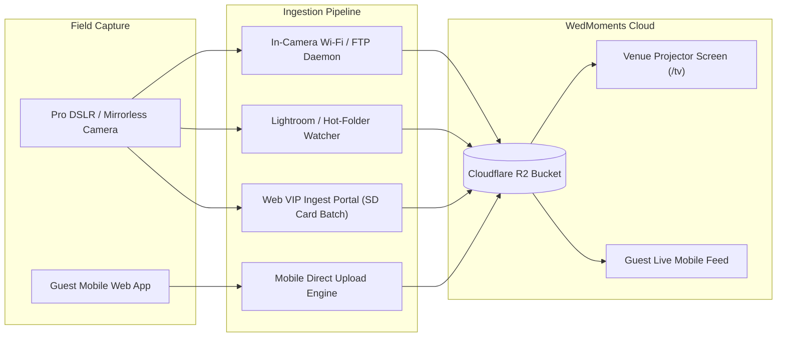

# 📊 WedMoments — Storage Architecture, Financial Model & B2B Growth Plan

---

## 1. Executive Summary

WedMoments is designed as a high-margin, scalable SaaS platform for live wedding and event photo aggregation. By leveraging **Cloudflare R2 Object Storage** (with **0.00 € egress/bandwidth fees**) paired with client-side compression and multi-tenant prefix partitioning, the platform achieves **98%+ gross profit margins** across all paid tiers.

This document outlines:
1. **Cloudflare R2 Multi-Tenant Storage Architecture** (Single Bucket + Subfolder Partitioning).
2. **Unit Economics & Financial Breakdown per SaaS Plan** (Free, Celebration Pass, Deluxe Keepsake, Pro Planner).
3. **DSLR / Professional Photographer Integration Blueprint** (FTP, Hot-Folder, and VIP Ingest Portal).
4. **Wedding Planner & Agency B2B Monetization Strategy**.
5. **Scaling Projections & Cloud Configuration Guide**.

---

## 2. Cloudflare R2 Storage Architecture

### A. The Single Master Bucket Strategy

All media across all weddings resides in **one single master Cloudflare R2 bucket** (`wedmoments-media`). Events are logically isolated using virtual key prefixes (`subfolders`):

```
wedmoments-media/  (Single Master Cloudflare R2 Bucket)
│
├── events/
│   │
│   ├── a0eebc99-9c0b-4ef8-bb6d-6bb9bd380a11/  (Event ID: Моника и Александър)
│   │   ├── wedding-original-1787938532-purkml.jpg  # Untouched upload (ZIP export)
│   │   ├── wedding-photo-1787938532-vokcft.jpg     # Display copy, long edge 1600px
│   │   ├── wedding-thumb-1787938532-s8vv9o.jpg     # Feed thumbnail, long edge 400px
│   │   ├── pro-1787938590-z1seev-original.jpg      # Photographer frame
│   │   ├── pro-1787938590-z1seev.jpg
│   │   ├── pro-1787938590-z1seev-thumb.jpg
│   │   └── audio-message-1787938600-k35pk6.webm    # Audio guestbook
│   │
│   └── b1ffcd88-8b1a-3ef7-aa5c-5aa8ac270b22/  (Event ID: Елена и Димитър)
```

> Keys are flat within each event prefix and distinguished by filename, not by
> `photos/` and `audio/` subfolders. ZIP exports are **streamed on demand** and
> never stored, so there is no `exports/` prefix and no storage cost for them.

### B. Architectural Advantages

| Metric | 1 Master Bucket with Subfolders | Creating 1 Bucket Per Wedding |
| :--- | :--- | :--- |
| **Account Limits** | **Unlimited weddings** (1,000,000+ weddings in 1 bucket) | Cloudflare raised the per-account bucket cap to 1,000,000 (was 1,000) — a per-wedding bucket is no longer *impossible*, just needlessly complex vs. one bucket with key prefixes |
| **Custom Domain & CDN** | **1 single domain** (`photos.wedmoments.bg`) | Must provision and route DNS for every new wedding |
| **Provisioning Latency** | **0.00 seconds** (Virtual prefixes require no API calls) | 2–5 seconds per event to create and configure bucket |
| **Security & Isolation** | Cryptographic random UUIDs + PostgreSQL `WHERE event_id = $1` | Complex per-bucket IAM policies |
| **1-Click ZIP Exports** | Stream directly via prefix `events/{eventId}/` | Requires multi-bucket routing |
| **Atomic Deletion** | Single batch delete on prefix `events/{eventId}/` | Must drain and destroy cloud bucket resource |

---

## 3. SaaS Plans, Quotas & Financial Unit Economics

### A. Customer Plan Specifications

| Plan Name | Customer Price | Quota Allocation | Photo Limit | Retention Period | Key Features |
| :--- | :---: | :---: | :---: | :---: | :--- |
| **Безплатен тест (Free)** | **0.00 €** | 500 MB (0.5 GB) | 50 photos | 7 Days | QR mobile camera, live feed, basic gallery |
| **Celebration Pass** | **49.00 €** *(one-time)* | 10 GB | Unlimited | 3 Months | Live TV Projector, Scavenger Quests, QR Canvas Studio, High-Res ZIP |
| **VIP "Луксозен спомен"** | **89.00 €** *(one-time)* | 25 GB | Unlimited | 12 Months | Everything in Pass + Vintage Audio Guestbook, Disposable Camera, 20% book discount |
| **Pro Planner** | **49.00 € / mo** *(subscription)* | 100 GB Pool | Unlimited | Ongoing | Up to 10 active weddings concurrently, multi-event dashboard, agency roles |

---

### B. Unit Economics & Cost vs. Profit Analysis

> **Storage Cost Baseline**: Cloudflare R2 = **\$0.015 / GB-month (~0.014 €)** with **0.00 € Egress / Bandwidth Fees**. Verified against `developers.cloudflare.com/r2/pricing` (2026-09-05) — unchanged since this document was first written. R2 also bills per-request: Class A (writes — each photo upload is 3: original + display + thumbnail) at \$4.50/million after a free 1M/month, Class B (reads) at \$0.36/million after a free 10M/month. Omitted from every breakdown below because it is genuinely immaterial here — even the heaviest scenario in §C (2,800 photos/wedding, ~3 writes each) is a few thousand Class A ops, a small fraction of a cent, nowhere close to the free monthly allowance at this app's scale.

```
┌────────────────────────────────────────────────────────────────────────────────────────┐
│                               "BUFFET" STORAGE ECONOMICS                               │
│                                                                                        │
│  Customers buy a generous quota (10 GB or 25 GB) for peace of mind.                    │
│  In practice, client-side compression reduces average event usage to 2 GB – 6 GB.     │
│  You collect the full fee upfront, paying only pennies for actual bytes stored.        │
└────────────────────────────────────────────────────────────────────────────────────────┘
```

#### Detailed Breakdown Per Tier:

1. **Free Test Plan (`0.00 €`)**:
   - *Expected Usage*: ~150 MB for 7 days.
   - *Raw Storage Cost*: **0.00 € only for the first ~65 free events.** R2's 10 GB
     free allowance is per-account, not per-customer — see "Free-tier accounting
     is wrong" below. Past that, every free event costs real money.
   - *Gross Margin*: N/A (Customer acquisition & viral lead magnet).

2. **Celebration Pass (`49.00 €` One-Time)**:
   - *Expected Usage*: ~3.0 GB average over 3 active months.
   - *Raw Storage Cost*: $3\text{ GB} \times \$0.015 \times 3\text{ months} = \$0.135 \approx \mathbf{0.12\text{ €}}$.
   - *Bandwidth / TV Streaming / ZIP Egress*: **0.00 €** *(R2 zero-egress)*.
   - *PostgreSQL & Compute Share*: ~0.15 €.
   - *Total Infrastructure Cost*: **~0.27 €**.
   - **Gross Profit**: **+48.73 € per wedding (99.4% Gross Margin)**.

3. **VIP Deluxe Keepsake (`89.00 €` One-Time)**:
   - *Expected Usage*: ~6.0 GB average over 12 months *(High-res photos + voice messages)*.
   - *Raw Storage Cost*: $6\text{ GB} \times \$0.015 \times 12\text{ months} = \$1.08 \approx \mathbf{1.00\text{ €}}$.
   - *Bandwidth / Egress*: **0.00 €**.
   - *PostgreSQL & Compute Share*: ~0.30 €.
   - *Total Infrastructure Cost*: **~1.30 €**.
   - **Gross Profit**: **+87.70 € per wedding (98.5% Gross Margin)**.

4. **Pro Planner Subscription (`49.00 € / month`)**:
   - *Expected Usage*: ~30.0 GB active across up to 10 simultaneous client weddings.
   - *Raw Storage Cost*: $30\text{ GB} \times \$0.015 = \$0.45 \approx \mathbf{0.42\text{ € / month}}$.
   - *Bandwidth / Egress*: **0.00 €**.
   - *PostgreSQL & Compute Share*: ~0.50 € / month.
   - *Total Infrastructure Cost*: **~0.92 € / month**.
   - **Gross Profit**: **+48.08 € / month (98.1% Gross Margin / 577.00 € net per agency annually)**.

---

## 4. Professional DSLR / Mirrorless Camera Integration

WedMoments supports integrating professional photographer gear (Sony, Canon, Nikon, Fujifilm) alongside guest mobile snapshots.



### 3 Integration Methods:

1. **Direct In-Camera Wi-Fi / FTP Background Upload**:
   - Modern cameras (Sony α7 IV/α9, Canon R5/R6, Nikon Z8/Z9) connect to a Wi-Fi hotspot and background-stream compressed JPEGs via FTP directly to the WedMoments server upon shutter press.
   - Latency: **3–5 seconds** from capture to live venue screen.

2. **Lightroom / Capture One "Hot-Folder" Sync**:
   - Ideal for tethered shoots or on-site editing assistants.
   - Exporting graded JPEGs to a watched folder triggers an automatic API upload
     (`POST /api/ingest/:eventId/photos`). Implemented in `scripts/ingest-watcher.ts`
     — run it with `npm run ingest:watch`.

3. **VIP Photographer Ingest Portal (Batch Drag-and-Drop)**:
   - Dedicated portal at `/e/:slug/ingest`. The photographer pastes their ingest
     key (`wmi_...`), which travels in the `X-Ingest-Key` header. Keys are **not**
     accepted from the query string — a key in a URL ends up in access logs,
     proxy history and browser referrers.
   - Photographers can drag-and-drop 100+ full-resolution photos directly from their SD card reader during event intermissions.
   - Photos automatically receive the gold **"Официален Фотограф"** badge and get **priority projection on the Live TV wall**.

---

## 5. Wedding Planner & Agency B2B Strategy

### How Agencies Monetize WedMoments:
* **The "Live Venue Screen & Guest Experience" Upsell**: Planners bundle WedMoments into their agency packages for **150.00 € – 250.00 €**, generating pure profit against their 49.00 €/mo subscription.
* **Photo Booth Alternative**: Replaces physical 500 € photo booths with an all-day digital solution that covers every corner of the venue.

### Roadmap for B2B Agency Features:
* **Agency White-Labeling**: Custom branding (*"Organized by [Agency Name]"* with agency logo and Instagram link).
* **Interactive Day-of Timeline**: Live guest schedule (Ceremony, First Dance, Cake Cutting) with real-time push alerts.
* **Vendor Directory**: Highlighting the DJ, Florist, Venue, and Photographer for organic viral referrals.
* **Automated Post-Event PDF Summary**: Beautiful branded statistics recap for newlyweds.

---

## 6. Financial Growth Projections

| Season Milestone | Active Weddings | Mix Breakdown | Monthly Cloud Cost (R2 + DB) | Monthly Revenue | Net Monthly Profit |
| :--- | :---: | :--- | :---: | :---: | :---: |
| **Launch Stage** | 10 | 7 Pass, 2 VIP, 1 Planner | ~1.50 € | 569.00 € | **+567.50 €** |
| **Growth Stage** | 50 | 35 Pass, 10 VIP, 5 Planners | ~6.50 € | 2,850.00 € | **+2,843.50 €** |
| **Established Platform** | 200 | 140 Pass, 40 VIP, 20 Planners | ~24.00 € | 11,400.00 € | **+11,376.00 €** |
| **Enterprise Scale** | 1,000 | 700 Pass, 200 VIP, 100 Planners | ~115.00 € | 57,000.00 € | **+56,885.00 €** |

---

## 7. Cloudflare R2 Production Environment Setup

Add these keys to your production backend `.env` file:

```env
# Storage Provider — the variable is STORAGE_PROVIDER, not STORAGE_DRIVER.
# An unrecognized value, or "r2" with missing/incomplete R2 credentials, now
# crashes at startup instead of silently falling back to local disk
# (OPEN_ITEMS.md G6) — on an ephemeral production container filesystem, that
# fallback used to mean every wedding photo was lost on the next redeploy.
STORAGE_PROVIDER=r2

# Cloudflare R2 Credentials
R2_ACCOUNT_ID=your_cloudflare_account_id_here
R2_ACCESS_KEY_ID=your_r2_access_key_id_here
R2_SECRET_ACCESS_KEY=your_r2_secret_access_key_here
R2_BUCKET_NAME=wedmoments-media
R2_PUBLIC_URL=https://photos.wedmoments.bg
```

> `R2_BUCKET_NAME` must match the bucket you actually created. The application
> default is `wedmoments-photos` (`server/lib/config.ts`), so set this explicitly
> rather than relying on the default.

---

---

## 8. Reality check — what is built, and what the model depends on

*Added 2026-08-29 after auditing this document against the code.*

### A. What is genuinely implemented

| Claim | Status |
| :--- | :--- |
| Single R2 bucket with `events/{eventId}/` prefix partitioning | ✅ `server/lib/storage.ts` |
| Zero-egress delivery via R2 | ✅ Architectural, correct — R2 charges no egress |
| Multi-tenant isolation by `event_id` | ✅ Enforced in every query |
| Streamed ZIP export (no stored archive) | ✅ `GET /api/events/:id/export-zip` |
| FTP / hot-folder / VIP portal ingest | ✅ All three paths exist and are tested |
| `event_limit` enforcement (Pro Planner = 10) | ✅ `POST /api/events` |
| Free-tier 50-photo cap, failing closed | ✅ `checkPhotoUploadTierLimit` |

### B. What the plan assumes but the code does not do

These are the load-bearing gaps. The margin numbers above are only reachable
once they exist.

1. **Real billing exists now, pending real keys.** As of 2026-09-05,
   `POST /api/billing/checkout-session` creates a genuine Stripe Checkout
   Session (`server/routes/billing.ts`), and the tier is written only from
   `POST /api/billing/webhook` once Stripe confirms the payment actually
   happened (`checkout.session.completed`) — not from any client-triggerable
   call. `POST /api/subscriptions/upgrade` (the old direct write) still
   exists purely as the pre-Stripe fallback: while `STRIPE_SECRET_KEY`/
   `STRIPE_WEBHOOK_SECRET` are unset, the pricing modal catches the
   resulting `503 STRIPE_NOT_CONFIGURED` and falls back to it automatically,
   so local dev and demos keep working with zero setup. Every revenue figure
   in section 6 becomes collectable the moment real Stripe keys are added to
   `.env` — no code change needed. See OPEN_ITEMS.md for the fuller history
   (P1/SEC-05, the original bug this closed) and the Stripe integration
   write-up.

2. ~~**Storage quotas are not enforced.**~~ **Implemented.** Migration 008 adds
   per-object byte accounting and a trigger-maintained `events.storage_bytes`
   running total. `server/lib/planLimits.ts` holds the allowances, and every
   upload path — guest photos, photographer ingest, audio — charges its real
   footprint before writing and is refused with `STORAGE_LIMIT_REACHED` when the
   plan is spent. Pro Planner pools its allowance across the host's events. Hosts
   see their position on the dashboard (`GET /api/events/:id/usage`).

3. ~~**Retention is not enforced.**~~ **Mechanism implemented, deletion opt-in.**
   `events.expires_at` is stamped at creation from the plan's window and
   recomputed by `npm run retention:report`. The window starts at the
   *celebration*, not the setup date, so a couple who plans months ahead does not
   lose what they paid for.

   Deletion is deliberately **not** automatic: `npm run retention:report` only
   reports, and `npm run retention:sweep` (which sets `RETENTION_ENFORCED=true`)
   deletes only albums past a 30-day grace period. These are irreplaceable
   wedding photos; removing them is never a side effect of a maintenance task.
   Wire the sweep into cron once you are satisfied with what the report shows.

   Two fixes landed since this was first written, both dormant until the sweep
   is actually turned on: the bulk purge used to fire one `UPDATE events`
   statement per deleted photo (thousands of sequential row-locked writes on
   the exact same row for a large album — WAL bloat, lock contention); it now
   disables the row trigger for the duration of the purge and sets
   `storage_bytes = 0` once (OPEN_ITEMS.md DB-01). Separately, a purge left the
   now-empty `uploads/events/<id>/` directory behind, which made
   `npm run storage:orphans` report a nonzero folder count even at `0 files`;
   `purgeEventMedia()` now removes it (OPEN_ITEMS.md G4).

4. **Free-tier accounting is wrong.** Cloudflare's 10 GB free allowance is
   per-account, not per-customer. At ~150 MB per free event, roughly 65 free
   weddings exhaust it — after which free users cost real money.

### C. Revised storage assumptions

Since migration 007 each photo is stored three ways — original, 1600px display
copy, and 400px thumbnail — so the paid "original quality" download is real.
That raises per-photo storage roughly **10×** over the previous
compressed-only pipeline.

| Source | Original | Display | Thumb | Total per photo |
| :--- | ---: | ---: | ---: | ---: |
| Phone (12 MP) | 3–5 MB | ~350 KB | ~30 KB | **~4.5 MB** |
| DSLR JPEG (24 MP) | 8–15 MB | ~400 KB | ~30 KB | **~10 MB** |

| Scenario | Photos | Storage |
| :--- | :--- | ---: |
| Guest-only wedding | 400 guest | **~1.8 GB** |
| Typical with photographer | 400 guest + 800 pro | **~10 GB** |
| Heavy multi-shooter | 800 guest + 2,000 pro | **~24 GB** |

### D. Do the margins survive?

Yes — comfortably. Storage is not the risk.

| Tier | Doc assumption | Realistic heavy case | Storage cost (heavy) | Margin |
| :--- | ---: | ---: | ---: | ---: |
| Celebration Pass (49 €, 3 mo) | 3 GB | 10 GB | ~0.42 € | **~99%** |
| Deluxe Keepsake (89 €, 12 mo) | 6 GB | 24 GB | ~4.00 € | **~95%** |
| Pro Planner (49 €/mo) | 30 GB | 100 GB | ~1.40 €/mo | **~96%** |

Even at 5–8× the document's storage assumptions the business stays above 95%
gross margin. The **98%+** headline is optimistic; **95%+** is defensible. Zero
egress is the genuine structural advantage, and it is real.

### E. The actual risks

Ranked by how much they threaten the model:

1. **Billing needs real Stripe keys.** The integration itself is built and
   tested (§8.B above) — nothing is collectable only until `STRIPE_SECRET_KEY`/
   `STRIPE_WEBHOOK_SECRET` are added to production `.env` and a webhook
   endpoint is registered in the Stripe Dashboard pointed at
   `POST /api/billing/webhook`.
2. **Retention is reported, not enforced.** The mechanism exists and the
   deadlines are computed, but nothing deletes until someone turns the sweep on.
   Until then a one-time fee still funds permanently accruing storage: at 1,000
   archived weddings averaging 10 GB that is 10 TB ≈ **150 €/month, growing
   forever**, against revenue booked years earlier. Turning on the sweep — and
   adding an R2 lifecycle rule to match — is what closes this.
3. **Peak concurrency, not monthly averages.** Weddings cluster on Saturday
   evenings. Section 6 models 1,000 weddings as a monthly average; the system
   must survive perhaps 60 of them running simultaneously between 18:00 and
   02:00, each with live WebSocket rooms, a projector wall, and sharp generating
   derivatives on upload. Scale-to-zero serverless is the wrong shape for that
   peak — provisioned capacity on Saturdays is the realistic answer, and it is
   not in the cost model.

### F. Recommended order

1. ~~Billing (checkout + webhook writing `subscriptions`).~~ **Built.** Add
   real `STRIPE_SECRET_KEY`/`STRIPE_WEBHOOK_SECRET` to go live.
2. Run `npm run retention:report` on a schedule, review it, then enable the
   sweep and add a matching R2 lifecycle rule. Notify hosts before deletion —
   `events.retention_notified_at` is reserved for exactly that.
3. Model Saturday peak concurrency and size compute for it.

Until billing exists, treat section 6 as a target, not a forecast. Quotas and
retention deadlines are now measured, so the storage side of the model can be
checked against reality rather than assumed:

```bash
npm run storage:recount   # re-measure every stored object
npm run retention:report  # what is expiring, and how much it holds
```

---

## 9. Session updates (2026-09-04 – 2026-09-05)

Between the reality check in §8 and now, a nine-phase security/architecture
pass fixed 60+ issues (auth, tier gating, storage accounting, WebSocket,
FTP ingest, database concurrency, and frontend memory/state bugs) — full
detail, one issue at a time with its regression test, is in `OPEN_ITEMS.md`,
which is the maintained source of truth for what has and hasn't been fixed.
This document has been corrected above wherever it made a claim that pass
proved wrong (the billing self-serve gap, the retention purge's row-lock
amplification, and the `STORAGE_PROVIDER` silent-fallback behavior); it has
not been rewritten wholesale around everything that pass touched, since most
of it (guest identity tokens, JWT purpose pinning, moderation/reveal gating)
doesn't change the storage or financial model this document exists to
describe.

---

## 10. Pricing verification (2026-09-05)

Checked every R2 pricing/limit claim in this document against
`developers.cloudflare.com/r2/pricing` and `/r2/platform/limits` directly
(not from training-data memory, since pricing pages change).

- **$0.015/GB-month standard storage, 10 GB/month free tier, zero egress** —
  all still accurate, unchanged.
- **"Cloudflare caps at 1,000 buckets"** (§2.B) — stale. The per-account cap
  was raised to 1,000,000 buckets. Corrected in the table; the underlying
  architectural conclusion (one bucket + prefixes beats one bucket per
  wedding) still holds on its other merits — no per-bucket IAM, one CDN
  domain, atomic prefix delete — the bucket-count ceiling was never the
  strongest of those reasons anyway.
- **Class A/B request pricing** — real cost category this document never
  mentioned. Added to §3.B's cost baseline note; confirmed immaterial at
  this app's actual usage pattern (a few thousand requests per wedding vs.
  the 1M/10M free monthly allowances).

No change to any margin figure in §3.B, §6, or §8.D — the correction is
factual (bucket limit) and additive (request pricing), neither moves the
storage-cost numbers those sections are built on.

---

*Document Author: WedMoments Engineering & Product Strategy Team*  
*Last Updated: 2026-09-05*
