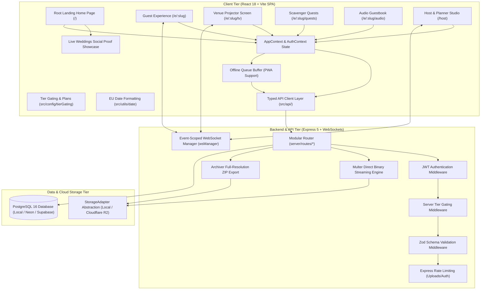

# 🏛️ WedMoments — System Architecture & Layer Design

## 1. High-Level System Topology

---

## 2. Layered Architecture Specifications

### Layer 1: Frontend Client (`src/`)
- **Landing Page & Social Proof**:
  - `LandingHomePage.tsx`: 8-section Bulgarian landing page on root `/` with zero emojis and clean `lucide-react` iconography.
  - `PublicWeddingsShowcase.tsx`: Live photo ribbon social proof cards for active Bulgarian weddings (*Моника и Александър*, *Елена и Димитър*, *Виктория и Кристиян*, *Десислава и Калоян*, *Силвия и Георги*, *Габриела и Никола*).
- **Single Currency Architecture**: Standardized 100% in Euro (**€**) across `plans.ts`, `PricingPlansModal.tsx`, `LandingHomePage.tsx`, and `LockedFeatureBadge.tsx`.
- **European Date Formatting** (`src/utils/date.ts`): Formats all timestamps in `DD.MM.YYYY` / `DD месец YYYY г.`.
- **State Management**: `AuthProvider` (JWT session & user profile) and `AppProvider` (event state, live photos feed, scavenger quests, audio entries, offline queue).
- **Typed API Clients** (`src/api/`):
  - `apiClient.ts`: Base fetch wrapper with automatic JWT `Bearer` token injection and typed error handling (`ApiError`).
  - `eventsApi.ts`: Event settings, showcase feed, QR canvas configurations, ZIP exports.
  - `photosApi.ts`: Photo upload, likes toggling, comments, moderation status, photo removal.
  - `questsApi.ts`: Quest creation, completion tracking.
  - `audioApi.ts`: Voice toast recordings and list retrieval.
  - `guestsApi.ts`: Guest profile upsert with stable `deviceFingerprint` persistence.
- **Resilience & UX**:
  - `ErrorBoundary.tsx`: Catches React rendering errors with graceful recovery.
  - `LoadingSpinner.tsx`: Polished animated loader during async slug resolution.
  - `EventNotFound.tsx`: Fallback view with CTA when an event slug does not exist.

### Layer 2: Modular Backend (`server/`)
- `server/index.ts`: Central server bootstrap with CORS, static asset handling, and SPA fallback.
- `server/lib/config.ts`: Central configuration for ports, JWT secrets, and database strings.
- `server/lib/db.ts`: PostgreSQL connection pool singleton.
- `server/lib/storage.ts`: `StorageAdapter` pattern decoupling the API from the physical file storage.
- `server/middleware/auth.ts`: Signs and validates signed JWT tokens (`requireAuth`, `optionalAuth`) and bcrypt password hashing.
- `server/middleware/tierGate.ts`: Enforces plan limits and feature locks (e.g. Audio Guestbook locked on `celebration_pass`).
- `server/middleware/validate.ts`: Zod schema validation for all request payloads.
- `server/middleware/rateLimit.ts`: per-device upload limit (20 req/min, plus a 600 req/min per-IP venue-wide backstop), auth protection (25 req/15min per IP), reaction throttling (30 req/min per device), and general `/api` throttling (3000 req/min, sized per venue). See `docs/SECURITY.md` §4 for the reasoning behind per-device vs per-IP keys.
- `server/ws/wsServer.ts`: Multi-tenant WebSocket server with isolated event-room channels (`JOIN_EVENT_ROOM`).

### Layer 3: Storage & Database Tier
- **Database**: PostgreSQL 16 (Local Docker container `:6532`, with instant compatibility for serverless **Neon** or **Supabase Postgres** — any standard connection string works).
- **File Storage**: `StorageAdapter` (`server/lib/storage.ts`) supports exactly two providers, chosen by `STORAGE_PROVIDER` (`local` or `r2` — any other value, or `r2` with incomplete credentials, now fails fast at startup instead of silently falling back):
  - `local` (default): `LocalStorageAdapter`, disk directory `uploads/`. Fine for development; on an ephemeral production container filesystem, every photo is lost on redeploy.
  - `r2`: `R2StorageAdapter`, Cloudflare R2 (S3-compatible, zero egress fees). There is no Supabase Storage adapter — Supabase is only usable here as a Postgres *database* host, not as the file store.

---

## 3. Real-Time WebSocket Event Protocol

All clients emit and listen to event-scoped broadcasts. `isHost` is never
accepted from the client — it is derived server-side from the verified `AUTH`
token before a `JOIN_EVENT_ROOM` is honored (SEC-01/SEC-D6); a client that
could simply claim `isHost: true` would defeat every server-side host check.

| Action / Event | Direction | Payload | Description |
| :--- | :--- | :--- | :--- |
| `CONNECTED` | Server → Client | `{ time }` | Sent immediately on socket open |
| `AUTH` | Client → Server | `{ token }` | Session JWT, sent right after the socket opens — never in the connection URL's query string (SEC-A5) |
| `JOIN_EVENT_ROOM` | Client → Server | `{ eventId, guestId? }` | Subscribes to a wedding event channel; `isHost` is computed server-side from the prior `AUTH`, not read from this message |
| `ROOM_JOINED` | Server → Client | `{ eventId, isHost }` | Acknowledges the join with the server-computed host flag |
| `LEAVE_EVENT_ROOM`| Client → Server | `{}` | Unsubscribes from active channel |
| `PHOTO_ADDED` | Server → Event Room | `Photo` | New guest photo uploaded and approved |
| `PHOTO_LIKED` | Server → Event Room | `{ photoId, guestId }` | Photo liked by attendee |
| `PHOTO_UNLIKED` | Server → Event Room | `{ photoId, guestId }` | Photo unliked by attendee |
| `COMMENT_ADDED` | Server → Event Room | `PhotoComment` | New guest message / toast on a photo |
| `PHOTO_STATUS_UPDATED` | Server → Event Room | `{ photoId, status }` | Host approved, featured, or hidden photo |
| `PHOTO_REMOVED` | Server → Event Room | `{ photoId }` | Photo deleted by host |
| `QUEST_ADDED` | Server → Event Room | `ScavengerQuest` | New photo challenge created |
| `QUEST_COMPLETED` | Server → Event Room | `{ questId, guestId }` | Guest completed a photo challenge |
| `QUEST_DELETED` | Server → Event Room | `{ questId }` | Host removed a photo challenge |
| `AUDIO_ADDED` | Server → Event Room | `AudioGuestbookEntry` | New voice message recorded |
| `EVENT_UPDATED` | Server → Event Room | `WeddingEvent` | Host modified wedding theme or details |
| `REACTIONS_BATCH` | Server → Event Room | `{ reactions: [{ reaction, guestName }] }` | Live reaction taps, coalesced for up to 200ms or 50 reactions before flushing (P6) — the projector wall fans these out exactly like individual taps |

Per-connection messages are rate-limited (20 / 10s) and a slow consumer whose
send buffer exceeds 512KB is disconnected rather than allowed to accumulate
unbounded server memory (DB-04/DB-06) — see `docs/SECURITY.md` §7.
