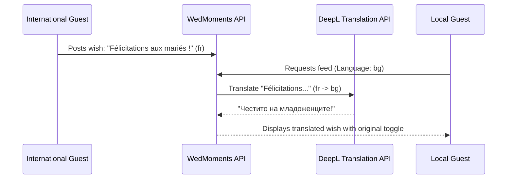

# 🌍 Global Internationalization (i18n) & Localization Strategy

This document outlines the architecture, translation structure, and implementation roadmap for **WedMoments**.

---

## 1. Native Bulgarian Default & Multilingual Parity

**Currently implemented: Bulgarian (`bg`) and English (`en`) only.**
`SupportedLanguage` (`src/i18n/index.ts`) is a two-value union; `es`, `it`,
`fr`, `de`, `pt` do not exist as dictionaries and are not selectable
anywhere in the app. Treat any mention of them elsewhere in this document as
roadmap, not shipped behavior.

WedMoments is built native in **Bulgarian (`bg`)** by default, while maintaining 100% dictionary parity with **English (`en`)**.

### Core Architectural Principles:
1. **Bulgarian Native First**: Every guest interface, camera prompt, audio guestbook flow, and host dashboard is natively authored in natural, elegant Bulgarian.
2. **Zero-Emoji Policy**: Language is represented by clean text codes (`BG`, `EN`) and React icons from `lucide-react` to ensure visual elegance and brand consistency.
3. **European Date Standards**: Standardized `DD.MM.YYYY` and localized Bulgarian month names (`18 септември 2026 г.`) via `src/utils/date.ts`.
4. **Single Euro Currency**: All prices and subscription fees are presented in Euro (**€**).
5. **Persisted, manual language choice — not browser auto-detection.** `I18nManager.detectLanguage()` (`src/i18n/index.ts`) only reads a previously-saved `wedmoments_lang` value from `localStorage`; it never reads `navigator.language`. A brand-new visitor — including a guest scanning a QR code for the first time — always starts on Bulgarian regardless of their phone's language setting, until they use the `BG`/`EN` toggle in the navbar. That choice is then remembered locally for their next visit.

---

## 2. Translation Architecture (`src/i18n/index.ts`)

- **Typed Keys**: Dictionary structure covers all functional modules:
  - `nav.*`: Navigation bars and action buttons
  - `hero.*`: Wedding countdown, date, and venue badges
  - `feed.*`: Live gallery, likes, comments, and empty states
  - `camera.*`: Capture view, romantic filters, and permissions
  - `quests.*`: Scavenger hunt missions and progress tracking
  - `audio.*`: Voice toast recording and playback
  - `profile.*`: Guest identity and selfie onboarding
  - `projector.*`: Fullscreen live TV presentation mode
  - `canvas.*`: QR Canvas print studio and format selectors
  - `pricing.*`: SaaS packages and subscription tiers
  - `host.*`: Moderation queue and settings

---

## 3. Recommended Translation Management Systems (TMS)

When scaling to 20+ languages with automated updates, the following industry services are recommended:

### A. 🏆 Crowdin (Recommended for SaaS Startups)
- **Website**: [crowdin.com](https://crowdin.com)
- **Why it fits**:
  - Direct GitHub integration: Automatically opens pull requests when translation dictionaries update.
  - In-Context visual localization: Translators can view the live UI while translating.
  - Machine pre-translation (DeepL, Google, OpenAI).

### B. 🌐 Lokalise
- **Website**: [lokalise.com](https://lokalise.com)
- **Why it fits**:
  - Over-the-air (OTA) localization updates: Deliver new translations without requiring frontend rebuilds.

---

## 4. Real-Time AI Auto-Translation for Guest Wishes & Toasts (Not Implemented)

**Roadmap only — no DeepL integration exists in this codebase today** (there
is no DeepL API call, key, or dependency anywhere in `server/` or `src/`).
The sequence below describes the intended design if this is ever built, not
current behavior:

When an international guest posts a wish in another language, attendees can view it translated into their native language:

